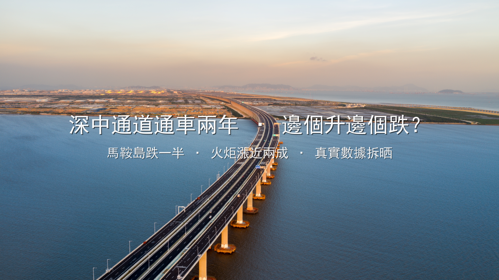

# 深中通道通車兩年真實真相：馬鞍島跌咗一半，火炬漲咗兩成——你當年被氹咗未？

我叫Jacky，中山人，祖籍廣西，喺中山做地產8年，帶過超過500組香港客睇樓。

2024年6月30日，深中通道通車。

你記唔記得通車之前，啲sales點同你講？

「而家買馬鞍島，通車之後一定升！」
「深中通道一開，呢度就係下一個前海！」
「而家唔買，通咗車你想買都買唔到！」

兩年之後嘅今日，我同你一齊計清條數。

> 數據來源：中山多個新房平台2026年6月成交數據、貝殼二手房掛牌數據、深中通道官方通行數據交叉比對，僅供參考。

---

## 馬鞍島：由3萬跌到1萬，跌咗超過一半

先講個事實。唔係我作嘅，係真實數據：

| 時間節點 | 馬鞍島新房（元/㎡） | 馬鞍島二手（元/㎡） |
|---------|:---:|:---:|
| 2022年中（通車前2年） | 2.6-3.0萬 | 2.4-2.8萬 |
| 2024年6月（通車當月） | 1.8-2.0萬 | 1.6-1.8萬 |
| 2025年6月（通車後1年） | 1.3-1.5萬 | 1.1-1.3萬 |
| **2026年6月（通車後2年）** | **1.0-1.7萬** | **0.8-1.3萬** |

由高峰期3萬，跌到而家1萬出頭。**跌咗超過50%。**

如果你2022年聽咗sales講，買咗個100平方米單位，300萬人仔。而家同類單位，150萬有找。未計利息、未計管理費、未計通脹。淨係本金已經蝕咗150萬。

你可能會問：「點解會咁？深中通道唔係大利好咩？」

---

## 點解馬鞍島「通車即跌」？三個字：供過於求

### 原因一：發展商起得太多、太快

通車之前嗰幾年，個個都諗住深圳人會湧過嚟。馬鞍島變咗發展商嘅戰場——雅居樂、萬科、招商、保利、粵海，全部插旗。同一時間推出海量樓盤，供應量遠超實際需求。

### 原因二：深圳人根本冇嚟

通車之後，深圳人確實有嚟——但係嚟睇樓，唔係嚟買樓。點解？

- **過橋費66蚊人仔，單程。** 來回132蚊，一個月返22日工，過橋費差唔多3,000蚊。
- **通勤時間唔係廣告講嘅30分鐘。** 深圳寶安去馬鞍島，理論上24公里。但計埋市區道路、早晚高峰排隊、過橋安檢，實際要1.5小時。日日來回3個鐘，冇人頂得順。
- **配套全部係「規劃中」。** 商場規劃中、學校規劃中、醫院規劃中。你住入去，連間茶餐廳都要揸車去。

### 原因三：投資客集體撤退

馬鞍島嘅買家結構，通車前90%以上係投資客——深圳投資客、廣州投資客、香港投資客。佢哋唔係買嚟住，係買嚟等升值。

通車之後，升值冇出現。投資客一齊放盤，二手供應爆燈。為咗甩手，個個劈價。你劈50萬，我再劈80萬——惡性循環。

而家馬鞍島嘅真實成交：

| 樓盤 | 均價（元/㎡） | 總價門檻 |
|------|:---:|:---:|
| 雅居樂灣際壹號 | ~11,000 | 80萬起 |
| 萬科城市之光（民眾） | ~10,900 | — |
| 招商臻灣府 | ~15,000 | 150萬起 |
| 中山粵海城 | ~15,000 | 一線臨海現房 |
| 萬科深業灣中新城 | 16,000-17,500 | 120萬起 |
| 保利天匯 | ~16,000 | 150萬起 |

比起高峰期，呢啲價錢已經「好平」。但問題係：**你買咗之後，賣俾邊個？** 馬鞍島二手市場到而家都冇真正嘅「用家」承接。

---

## 火炬開發區：同一個通道，點解佢漲咗18.7%？

而家講另一邊。

同一個深中通道、同一個通車時間。火炬開發區臨海片區，2026年Q1二手掛牌均價**同比漲咗18.7%**。中介帶看量翻咗2.3倍。

唔係概念炒作。係實打實有人搬過嚟住。

點解？

### 原因一：產業投產——有人、有工、有收入

智慧健康產業園二期已經投產，引進12家企業，平均月薪9,800蚊。即係有真實嘅就業人口、真實嘅居住需求。唔係投資客賭升值，係打工仔要搵地方住。

### 原因二：路網貫通——唔只得深中通道一條路

東部外環高速2025年12月貫通，火炬到深圳機場42分鐘。記住，42分鐘係「真實行車時間」，唔係廣告口號。配合深中通道，火炬嘅交通網絡係立體嘅，唔係單點嘅。

### 原因三：學位落地——有小朋友嘅家庭先會長住

中山港小學新校區今年9月啟用，學位多480個。聽落好細？但對於一個新發展區，480個學位代表嘅係幾百個家庭——真係搬過嚟住、真係日日接返學放學嘅家庭。

### 三樣齊：產業＋路網＋學位

馬鞍島得一個「通道出口」。火炬有工廠、有學校、有醫院、有商業。**有人真正搬過嚟住、每日用呢條路返工。**

呢個就係差距。

---

## 核心教訓：路係工具，人先係價值

深中通道係一條路。路本身唔會令樓升值。

路嘅價值在於——**有咩人去用呢條路，同埋佢哋用嚟做咩。**

| | 馬鞍島 | 火炬開發區 |
|------|------|------|
| 深中通道角色 | 概念炒作嘅理由 | 日常通勤嘅工具 |
| 買家結構 | 90%+投資客→集體撤退 | 產業人口+本地剛需 |
| 配套現狀 | 大部分「規劃中」 | 產業投產、學校落地 |
| 二手市場 | 劈價求售、冇人接盤 | 帶看量翻2.3倍 |
| 兩年表現 | **跌超50%** | **漲18.7%** |

同一個深中通道。兩個完全唔同嘅結果。

呢個唔係馬後炮。2024年通車嗰陣，我已經同啲客講：**買有產業嘅板塊，唔好買得個出口嘅板塊。**

---

## 對港人嘅啟示：你應該點睇「概念」？

港人嚟中山買樓，最容易中嘅伏就係「概念」兩個字。

深中通道係概念。四代宅係概念。南中城際係概念。每個概念聽落都好吸引、好似係「最後機會」。

但我想同你講：

### ✅ 值得考慮嘅板塊（有產業、有人、有配套）：

- **火炬開發區（近博愛路/中山站一帶）**：產業落地、路網成熟、港企樓盤對港客友好。中銘新達城98萬人仔起、越秀建發璽樾1.2-1.6萬/方。
- **東區**：配套最成熟、最穩陣，永遠唔會大錯。華鴻禧悅軒1.26萬起、利和文華里1.1-1.35萬。
- **西區**：性價比最高，近深中通道西出口、港車北上方便。華潤仁恆公園四季1.1-1.8萬、華盈四季藍天6688/方起。

### ⚠️ 要極之小心嘅板塊（概念溢價、配套滯後）：

- **馬鞍島**：價錢跌咗好多，但「平」唔代表「抵」。除非你係長線投資（10年+）、而且接受到配套成熟之前嘅唔方便。自住客、退休客、即買即住客——馬鞍島大部分區域唔適合你。

---

## Jacky講真話

我知呢篇文會得罪好多人。馬鞍島仲有好多盤要賣，發展商同代理未必鍾意我咁樣講。

但我係中山人，祖籍廣西，做咗8年地產。我嘅責任係同你講真話——包括話你知邊度跌、邊度升、邊度值得睇、邊度要避開。

深中通道通車兩年，俾我哋最大嘅教訓係：

**中山買樓，配套＞概念。你係買一個生活場所，唔係買一個故事。**

路會通、橋會起、政策會變。但一個地方有冇人真正想住——呢個先係決定樓價長線走勢嘅唯一因素。

如果你身邊有朋友仲喺度諗「深中通道概念盤」，**轉發呢篇文俾佢。** 佢可能會唔開心十分鐘，但會多謝你十年。

---

## 想知你嘅預算最啱買邊個區？

我整理咗一份 **《2026深中通道沿線板塊真實對比表》**，入面有：

✅ 深中通道沿線7個板塊兩年真實樓價走勢
✅ 各板塊產業＋配套＋學位完整對照
✅ 港人最值得關注嘅5個「有產業」板塊
✅ 3個「概念溢價」板塊避坑指南

**PM我，免費攞。我親自覆你。**

---

*港人中山置業通 Jacky · 中山人，祖籍廣西，從業8年 · 數據來源：中山多個新房平台2026年6月成交數據、貝殼二手房掛牌數據、深中通道官方通行數據交叉比對*
